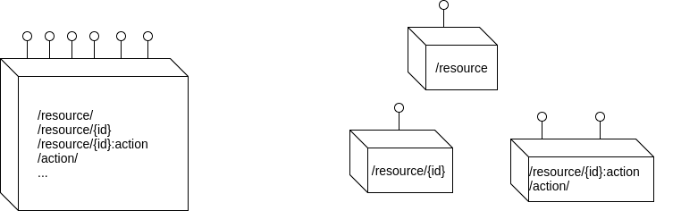
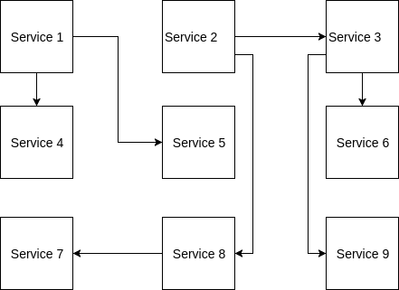

#  Goodbye to monolithic architectures!, Welcome Microservices!

## ¿Que es un Microservicio?

Pequeñas funcionalidades que permiten realizar una acción: consulta, modificación, eliminación, etc



### Ventajas

- Fácil escalado
- Fácil desarrollo
- Lenguajes de Desarrollos heterogéneos

### Desventajas

- Díficil de implementar
- Encontrar un equilibrio
- Acotar un microservicio

## Construyendo un Microservicio sencillo

Trabajamos sobre el servicio node, en el directorio nodejs_service.

Construirmos la imagen docker y la "tagueamos" con la versión correspondiente: 

```
docker build -t node_service:1.0.0 .
```

Ahora arrancamos la imagen construida:

```
docker run -d -p 8080:8080 node_service:1.0.0
```

Probamos los resultados obtenidos:

```
curl -i localhost:8080/foo
```

## Ecosistema de Microservicios

Normalmente tenemos todas las funcionalidades que ofrecemos divididos en varios microservicios diferentes.




## Construyendo un ecositema de Microservicios

Usamos Docker Compose para levantar una vpn con todos los servicios de nuestro ecosistema:

```
docker-compose -f docker-compose.basic.yml up -d 
```

Bajo demanda intentamos hacer un escalado de estos servicios:

```
docker-compose -f docker-compose.basic.yml scale node=3
```

Esto debe fallar según la configuración que hemos usado.

## Escalando los servicios

Usando la configuración adecuada, estamos en la misma situación anterior, salvo que todas las llamadas entran por el mismo punto de entrada:

```
docker-compose -f docker-compose.gateway.yml up -d 
```

Si ahora intentamos escalar, nuestro NGINX (con docker-gen) se encargará de descubrir los nuevos nodos:

```
docker-compose -f docker-compose.gateway.yml scale node=3
```

Atención a la cabecera *x-origin*:

```
curl -H 'Host: node' -i localhost/foo
```

## Service Mesh

Este concepto es que proporciona una mayor felixibilidad entre los componentes de una arquitectura de microservicios.


